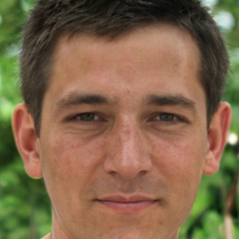

# Siarhei Muliarenka

### Contact information:

**Phone:** +375 (29) 517-79-98 
**Email:** warwhisper@tut.by 
**Telegram:** warwhisper 
**[LinkedId](https://www.linkedin.com/in/sierhei-muliarenka-9a8163115)**

---
### Briefly About Myself:
I have started my cariera as a programmer for SCADA-systems. I developed the software for PC to control the chemical proсesses. Then I have some cources of programming PLC-controllers: Alan Bredlly and Siemens. At the same time I got some skills in C# - ASP.Net - SQL stack to develop software for integration SCADA-systems and Enterprise level.

Some times ago I've become passionate the Web Development . It provides you enless possibilities for develope anything you can imagine.

I believe, that my ability to learn and to gain new skills will lead me through this path of becoming a proficient Frontend Developer.

---
